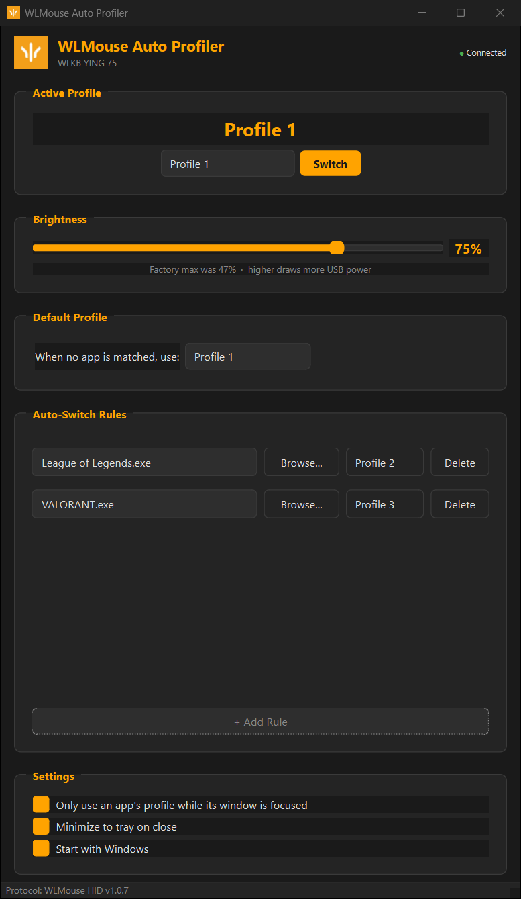

# WLMouse Auto Profiler

Automatically switches your **WLKB YING 75** keyboard profile based on which application is running.

Launch a game → keyboard switches to your gaming profile. Close it → back to default.

  



## How it works

The WLMouse YING 75 keyboard stores multiple profiles with different key configurations, actuation points, and lighting. The HID protocol was decoded by analyzing the JavaScript source of the official Web Hub configurator, allowing profile-switch commands to be sent directly from Python.

1. **Watches the focused window** — polls every second; a rule matches if the focused window belongs to its process or a child of it (e.g. `VALORANT.exe` → `VALORANT-Win64-Shipping.exe`)
2. **Sends HID command** — when a match is found, sends the profile-switch packet over USB
3. **Reverts when you leave** — alt-tab, minimize or close the app and it switches back to your default profile

Uncheck *"Only use an app's profile while its window is focused"* to match whenever the process is running instead.

## Features

- Auto-connect to keyboard on launch
- Auto-start monitoring on launch
- Process → Profile mapping with file browser
- Manual profile switching
- Brightness control with unlocked max (beyond the hub's ~47% cap)
- Configurable default profile
- Minimize to system tray
- Start with Windows (registry-based)
- Single instance lock (prevents duplicate processes)
- Dark theme UI matching WLMouse branding

## Setup

```bash
pip install -r requirements.txt
python step3_auto_profiler.py
```

### Requirements

- Python 3.10+
- Windows 10/11
- WLMouse WLKB YING 75 connected via USB

## Project Structure

| File | Description |
|------|-------------|
| `step3_auto_profiler.py` | Main app — GUI, process monitoring, profile switching |
| `wlmouse_protocol.py` | HID protocol — packet builder for the WLKB YING 75 |
| `config.json` | User config — device info, profiles, rules, settings |
| `step1_hid_scanner.py` | Utility — lists all HID devices to find VID/PID |
| `patch_firmware_brightness.py` | Utility — patches the firmware brightness table (persistent unlock) |
| `FIRMWARE_ANALYSIS.md` | Deep reverse engineering of the XS117 RISC-V firmware binary |

## How the protocol was decoded

1. **Identified the device** using `hidapi` to enumerate HID devices and find the vendor-specific interface (`usage_page: 0xFFA0`)
2. **Analyzed the Web Hub source** — the official WLMouse web configurator JavaScript contains all protocol logic, including packet structures and command IDs
3. **Decoded the packets** — profile switch uses a 64-byte report with header `0x5C 0x04`, command byte `0x70`, and the profile ID in the payload

### Device Info

| Field | Value |
|-------|-------|
| Vendor ID | `0x36A7` |
| Product ID | `0xF887` |
| Usage Page | `0xFFA0` (vendor-specific) |
| Config Interface | 2 |
| Protocol Version | 1.0.7 |
| Firmware | App V1.0.2 |
| MCU | XS117 (RISC-V 32-bit + RVC, custom/undocumented) |
| RTOS | FreeRTOS |

## Firmware Analysis

A deep reverse engineering of the firmware binary is documented in [`FIRMWARE_ANALYSIS.md`](FIRMWARE_ANALYSIS.md). Key findings:

- The MCU is a **custom RISC-V chip (XS117)** with no public datasheet
- The firmware runs **FreeRTOS** with separate tasks for keyboard scanning (`task_KB`), LEDs (`task_RGB`), and USB HID (`hid_loop`)
- The **USB reset on profile switch** only happens when the new profile has a **different polling rate** — give all profiles the same rate and switching becomes instant (see below)
- The profile switch handler uses **dynamically-registered callbacks** through indirect function pointers, making static binary patching difficult
- Most of the application code is **LZ-compressed** in flash and decompressed into RAM at boot (see "Brightness unlock" in the analysis); strings like `switch config` are referenced from that code
- **Brightness is capped at ~47%** by a lookup table, not by hardware (see below)

## Instant Profile Switching

The keyboard only reboots on a profile switch when the target profile has a different polling rate (`EP_TICK`): the rate is part of the USB descriptor (`bInterval`), so the firmware resets the MCU to re-enumerate. If every profile uses the **same polling rate**, the switch is instant with no USB disconnect.

## Brightness Unlock

The firmware maps luminance levels 0–4 to PWM values `[0, 30, 50, 80, 120]`, and each LED channel is computed as `(color × value) >> 8`. So the hub's maximum (level 4) is only **120/256 ≈ 47%**. Levels above 4 sent over HID are clamped back to 4.

An undocumented command (`CMDPack` orders `0x40`–`0x43`) reads/writes the table entries for levels 1–4 at runtime. The app's **Brightness** slider goes from 0 to 100% of the real hardware maximum (the factory cap is 47%): it sets level 4 and rescales the whole table, so levels 1–3 and the Fn brightness keys scale along. The table lives in RAM, so the app re-applies it on connect and re-checks it every 3 s (any keyboard reset reverts it to stock).

For a persistent change without the app, `patch_firmware_brightness.py` patches the table in the firmware image (4 bytes + header CRC32). Flashing modified firmware is at your own risk.

> ⚠️ More brightness = more current over USB and more heat. Full white at 100% on every key may exceed what the USB port/keyboard was designed for — increase gradually.

## Disclaimer

This project is not affiliated with WLMouse. The HID protocol was decoded from the official Web Hub source for personal use. Use at your own risk.
